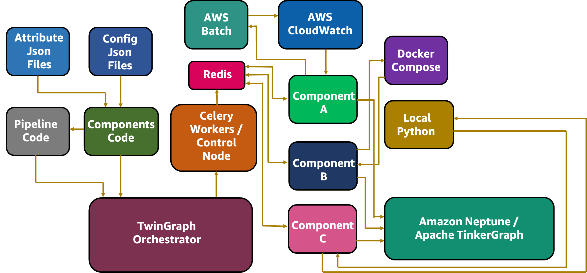

#   TwinGraph

TwinGraph provides a Python framework for high-throughput container orchestration for simulation, statistical predictive modeling and optimization workflows, including (a) asynchronized multi-host compute through (b) dynamic directed-acyclic-graph pipelines and (c) recording custom workflow attributes/artifacts within a graph database for repeatability and auditability. 


TwinGraph provides the capability to add decorators to Python functions, to record them in a [TinkerGraph](https://tinkerpop.apache.org/docs/current/reference/) or [Amazon Neptune](https://aws.amazon.com/neptune/) database. It is also optionally a graph orchestrator using [Celery](https://docs.celeryq.dev/en/stable/getting-started/introduction.html) in the backend and runs the decorated functions on a chosen compute ([AWS Batch](https://aws.amazon.com/batch/), [AWS Lambda](https://aws.amazon.com/lambda/), [Amazon EKS](https://aws.amazon.com/eks/)) and software platform ([K8s](https://kubernetes.io/), [Docker Compose](https://docs.docker.com/compose/)) in an asynchronous manner. 

It is designed to scale up to hundreds of thousands of containerized compute tasks in a number of different compute nodes/hosts with seamless communication of information between tasks in an event-driven workflow chain. An example architectural flow of information is shown in the picture below. 



There are a number of key capabilities outlined in the following graphic for TwinGraph. Instead of domain specific language (DSL) for specifying pipelines, TwinGraph simply uses plain Python algorithms (loops, conditionals & recursion) in a dynamic manner, i.e. dependencies of graph structure on intermediate outputs and runtime stochasticity.


The examples highlighted in the next section provide an overview of the capabilities of TwinGraph.

### Supported Operating Systems:
* Linux
    * Amazon Linux 2, Centos 7, RHEL, Fedora, Ubuntu, etc.

## API Documentation

There are two API calls within TwinGraph - *component* and *pipeline* - information about these can be found [here](docs/APIDoc.md).


## Examples

There are a series of examples located in the examples/orchestration_demos folder. These are designed to show how TwinGraph can be used through the two exposed Python decorator APIs, 'component' and 'pipeline' to orchestrate complex workflows on heterogeneous compute environments. The summary and links to the individual Readmes is given below. Before running AWS service specific examples (Demo 1-) please ensure aws-cli is configured, and run [update_credentials.py](examples/utils/update_credentials.py). To stop running Celery tasks, use [stop_and_delete.py](examples/utils/stop_and_delete.py).

| Example        | Description |
| ----------- | ----------- |
| [Demo 1](examples/orchestration_demos/demo_1_graph_tracing/README.md)        | Demonstrate graph tracing capability with local compute|
| [Demo 2](examples/orchestration_demos/demo_2_docker/README.md)       | Building a Docker container & graph tracing with dockerized compute |
| [Demo 3](examples/orchestration_demos/demo_3_git_data/README.md)         | Automatically including git history in traced attributes |
| [Demo 4](examples/orchestration_demos/demo_4_celery_backend/README.md)      | Using Celery to dispatch tasks and perform asynchronous computing |
| [Demo 5](examples/orchestration_demos/demo_5_celery_K8s/README.md)      | Using Celery to dispatch and run containerized tasks on Kubernetes (MiniK8s, EKS) |
| [Demo 6](examples/orchestration_demos/demo_6_celery_aws_batch/README.md)        | Using Celery to dispatch and run containerized tasks on AWS Batch|
| [Demo 7](examples/orchestration_demos/demo_7_lambda/README.md)        | Using Celery to dispatch tasks to AWS Lambda|
| [Demo 8](examples/orchestration_demos/demo_8_docker_K8s_lambda_batch)        | Using Celery to dispatch multiple tasks to different platforms/environments|
| [Demo 9](examples/orchestration_demos/demo_9_neptunedb/README.md)        | Using Amazon Neptune instead of TinkerGraph for graph tracing |
| [Demo 10](examples/orchestration_demos/demo_10_multipipeline/README.md)        | Running multiple pipelines together |

## Installation Option 1: Quick Installation

### Prerequisites Step (install [Make](https://www.gnu.org/software/make/), [Git](https://git-scm.com/book/en/v2/Getting-Started-Installing-Git), [Docker](https://docs.docker.com/engine/install/) and [Python](https://www.python.org/downloads/)):
- RHEL/Centos/Fedora/AL2: 
```bash
sudo yum install make git docker python
```
- Ubuntu/Debian:
```bash
sudo apt-get install -y make git python3 python-is-python3 apt-transport-https curl gnupg-agent ca-certificates software-properties-common unzip python3-pip
curl -fsSL https://download.docker.com/linux/ubuntu/gpg | sudo apt-key add -
sudo add-apt-repository "deb [arch=amd64] https://download.docker.com/linux/ubuntu focal stable"
sudo apt install -y docker-ce docker-ce-cli containerd.io
```
- Clone the repository:
```bash
git clone https://github.com/aws-samples/twingraph.git
```
### Installation Step:
```bash
make install
make docker_containers_poetry
```
*Note that this step might indicate some missing packages on some distributions, please remedy this by installing any missing base packages as indicated during the installation.*

For users of Kubernetes and Amazon EKS, please also install [kubectl](https://kubernetes.io/docs/tasks/tools/install-kubectl-linux/) and [eksctl](https://github.com/weaveworks/eksctl/blob/main/README.md#installation) separately, and optionally Kubernetes [dashboard](https://kubernetes.io/docs/tasks/access-application-cluster/web-ui-dashboard/) for monitoring and debugging.
### Uninstallation Step:
```bash
make uninstall
```
* The packages [AWS-CLI](https://docs.aws.amazon.com/cli/latest/userguide/uninstall.html) and poetry virtual environment have to be removed manually:
```bash
poetry env remove <PATH-TO-PYTHON-EXE>
```
## (**OPTIONAL**) Installation Option 2: Running in Docker

* Install and ensure [Docker](https://docs.docker.com/engine/install/) with the [Compose](https://docs.docker.com/compose/) tool is running:
    ```bash
    docker info
    ```
* Run Docker Compose, and open an interactive shell:
    ```bash
    docker compose up -d
    docker exec -it twingraph-twingraph-1 bash
    ```
* Once completed, you can bring down all the containers:
    ```bash
    docker compose down
    ```
* Note that when using Compose, TwinGraph API decorator variables need to point to Redis, Gremlin server and TwinGraph hosts - examples included in the provided [Dockerfile](Dockerfile) should run without any changes with the provided [Compose script](docker-compose.yaml); key in 'tinkergraph-server' instead of 'localhost' when using the Gremlin visualizer in the *host* field. 
* If using the provided [Dockerfile](Dockerfile) without Compose, please replace the ENV vars in lines 3-5 with localhost or the host where the other containers are running.

## (**OPTIONAL**) Installation Option 3: Manual Full Installation Steps & Using Poetry Env

If you have any issues with the easy installation, and are not able to use Docker Compose, follow instructions [here](docs/ManualInstallation.md) for manually installing required packages and core modules of TwinGraph.

## Port Forwarding

The following ports need to be forwarded to visualize on the local/client machine on a web browser (e.g. on a local browser such as Chrome or Edge, go to localhost:PORT). For more details on how to port forward using various tools and a list of additional ports to forward, please see [here](docs/PortForwarding.md).

| PORT        | Description |
| ----------- | ----------- |
| 3000        | Gremlin Visualizer Viewing Port - Open localhost:3000 |
| 3001        | Gremlin Visualizer Data Backend |

**Security Best Practice**: When opening connections from a remote host (i.e. Linux machine running TwinGraph) to local client, ensure that security best practices are followed and the remote machine is not open to unrestricted access to the public (0.0.0.0/0). If using AWS resources, please consult with your security team for any concerns and follow AWS guidelines [here](https://docs.aws.amazon.com/vpc/latest/userguide/vpc-security-best-practices.html).
## Troubleshooting & Known Issues

The known issues and limitations can be found [here](docs/KnownIssuesLimitations.md).


## Testing Framework

Tests can be run using the PyTest system, with the following command:
```bash
cd tests
pytest
```
Note that AWS credentials need to be configured prior to running tests for AWS Batch and AWS Lambda, and Kubernetes config has to be done prior to Kubernetes tests.

## Contributing

We welcome all contributions to improve the code, identify bugs and adopt best development and deployment practices. Please be sure to run the tests prior to commits in the repo. Rules and instructions for contributing can be found [here](./CONTRIBUTING.md).

## License

[MIT-0](LICENSE)


## Credits

This open source framework was developed by the Autonomous Computing Team within Amazon Web Services (AWS) Worldwide Specialist Organization (WWSO), led by Vidyasagar Ananthan and Satheesh Maheswaran, with contributions from Cheryl Abundo on Amazon EKS Blueprints and Ross Pivovar on AWS Batch. The authors acknowledge and thank Adam Rasheed for his leadership and support to our team, and to Alex Iankoulski for his detailed guidance and contributions on Docker tools and expertise in reviewing the code.
