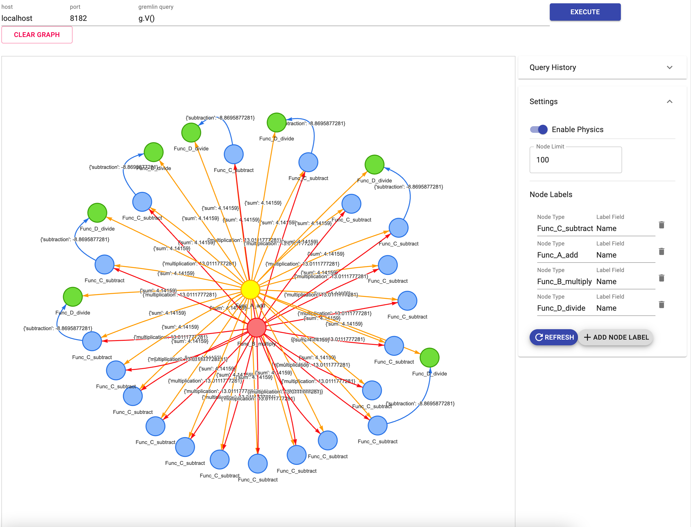

# Goal

Demonstrate how to use TwinGraph as a graph tracer on top of Python functions to create a pipeline, while running these functions locally as plain Python code.

This demo will also illustrate how to chain simple tasks together, and how to pass information from one task to another within an algorithmic pipeline.

Files

---

* deployment.py: Implementation of a selection of tasks to be traced within a TinkerGraph database
---

## Prerequisites  

1.  Either of the three installation options in the main [Readme](../../../README.md) have been completed
2.  Using the command ```docker container ls``` verify that at least two Docker containers are running, (a) a TinkerGraph server docker container and (b) for the visualizer. An example of these outputs is shown below:
```bash
docker container ls

CONTAINER ID   IMAGE                                   COMMAND                  CREATED        STATUS        PORTS                                       NAMES
1600a6c3c0c7   tinkerpop/gremlin-server:3.6.1          "/docker-entrypoint.…"   23 hours ago   Up 23 hours   0.0.0.0:8182->8182/tcp, :::8182->8182/tcp   trusting_lamarr
fd858263ecad   prabushitha/gremlin-visualizer:latest   "docker-entrypoint.s…"   3 days ago     Up 3 days                                                 gremlin-visualizer

```
3. The ports 3000, 3001 have been forwarded from the remote instance (if running on EC2 or cloud) to the local machine to visualize. This can be done through the command line using ssh (Linux/Mac $\rightarrow$  Linux) or Putty (Windows, see [here](../../../docs/PortForwarding.md) for more information). An example for Linux/Mac $\rightarrow$  Linux is to do the following command from your local machine (client) to the server (remote):

```bash
ssh -L 3000:localhost:3000 username@REMOTE-IP
ssh -L 3001:localhost:3001 username@REMOTE-IP
```
A more convenient alternative is to use remote development extensions on modern IDEs such as [VSCode](https://code.visualstudio.com/docs/remote/remote-overview).

## How to run the example

Run the orchestration pipeline within the Python script by the following command:
```bash
python deployment.py 
```

If successfully run, the output should log connections to the Gremlin server running in the background, such as this, for every node:

```bash
INFO:gremlinpython:Creating Client with url 'ws://127.0.0.1:8182/gremlin'
INFO:gremlinpython:Creating GraphTraversalSource.
INFO:gremlinpython:Creating GraphTraversalSource.
INFO:gremlinpython:closing DriverRemoteConnection with url 'ws://127.0.0.1:8182/gremlin'
```

Open the local web browser and connect to the port 3000, and key in host *localhost* (or where the visualizer is running - for example, if you are running with the Docker installation option, type *tinkergraph-server* instead of *localhost*), port *8182* (or the port forwarded from the visualizer) and gremlin query *g.V()*, and click on *EXECUTE*:
```url
https://localhost:3000
```



## Understanding the Python Code

Overall, this code includes the usage of `component` and `pipeline` decorators for demonstrates how to run a dynamic pipeline locally with no inputs to the decorator and in a serial manner. The code included in ```deployment.py``` has comments describing individual steps of the flow. 

