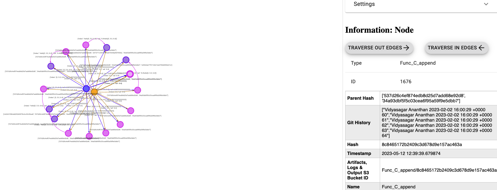

# Goal

Demonstrate how to display git history/meta data

Files

---
  
* deployment.py: Implementation of a selection of tasks to be run in the Docker container  
* attr.json: Meta data for the experiment/workflow  

---

## Prerequisites  

1.    Try Demo 1, and read through documentation and code for Demo 1.

## How to run the example

Run the orchestration pipeline
```bash
python deployment.py 
```

If your experiment ran successfully, your output should look something similar to this

## Understanding the Python Code

The only difference here is the inclusion of `git_data=True` in the component decorators.

