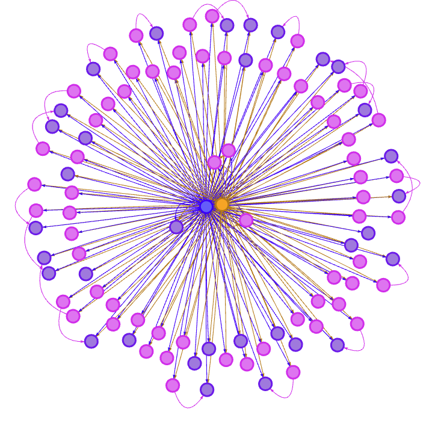

# Goal

Demonstrate how to use Celery to implement a pipeline with one component - this example will run a celery pipeline that consists of multiple functions

Files

---
  
* deployment.py: Implementation of a selection of tasks to be run in the Docker container  
* attr.json: Meta data for the experiment/workflow  

---

## Prerequisites  

1. Demo 1 & 2 have been run successfully
2. Background reading on [Celery](https://docs.celeryq.dev/en/stable/getting-started/introduction.html)
3. Read the API document on pipeline and components [here](../../../docs/APIDoc.md)

## How to run the example

Do the following in the order listed below

Run the orchestration pipeline
```bash
python deployment.py 
```
If you wish to interrupt or stop Celery, change directory to the utilities directory and run the provided script.
```
cd {YOUR DIRECTORY FOR TwinGraph}/examples/utils
python stop_and_delete.py
```

If your experiment ran successfully, your output should look something similar to this

## Understanding the Python Code

You will notice that there is only one change between the previous deployments and this - there are additional parameters for the pipeline.

