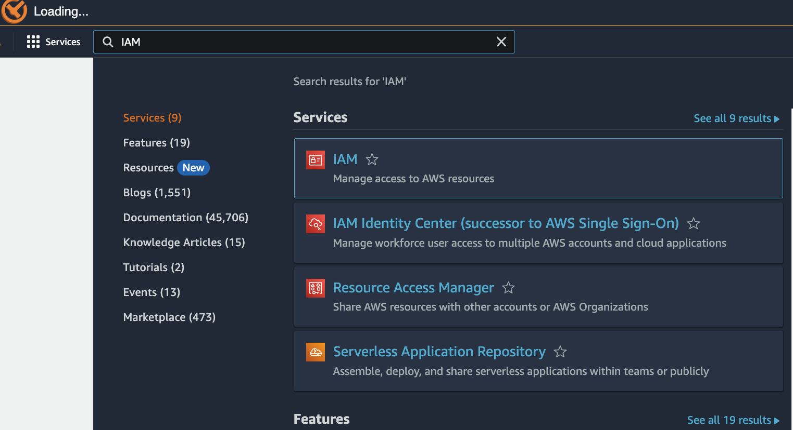
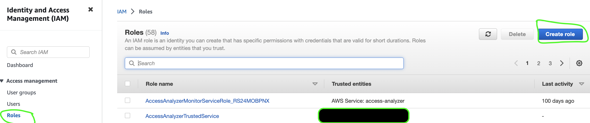
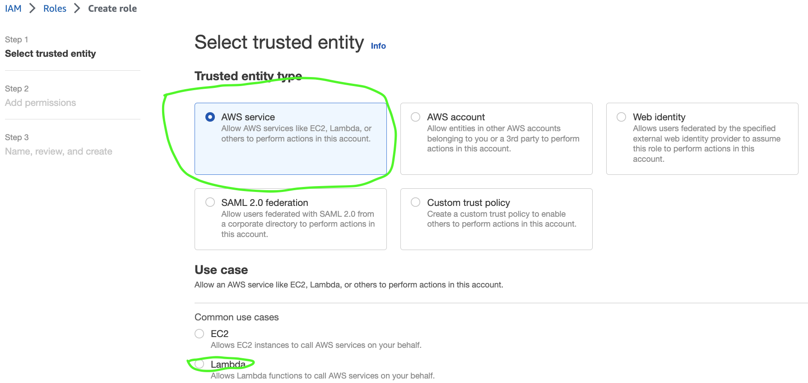
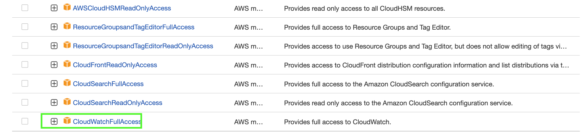
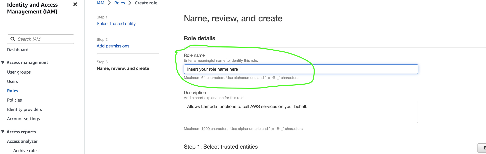

# Goal

Demonstrate how to run a workflow on AWS Lambda 

Files

---

* lambda_docker_image/Dockerfile: Dockerfile to describe what should be in the container
* lambda_docker_image/push_to_ecr.py: Push the created Docker image to ECR repository
* lambda_docker_image/build_tag_docker.py: Builds the Docker image
* lambda_docker_image/app/app.py: This is the app which is executed on AWS Lambda, packaged within a container.
* components/component_1.py: A set of functions defining the compute work
* components/component_2.py: A set of functions defining the compute work
* lambdaconfig.json: Configuration file related to the AWS Lambda service 
* deployment.py: Implementation of a selection of tasks to be run in the Docker container   

---

## Prerequisites  

1.    AWS CLI needs to be installed and configured (https://docs.aws.amazon.com/cli/latest/userguide/cli-chap-welcome.html)
2.    Elastic Container Registry needs to be setup (https://docs.aws.amazon.com/AmazonECR/latest/userguide/get-set-up-for-amazon-ecr.html)

## How to run the example

Do the following in the order listed below

Configure user 
```bash
aws configure
AWS Access Key ID: 
AWS Secret Access Key: 
Default region name: 
Default output format: 
```
Creating an Identity Access Management (IAM) role

AWS Lambda service will require an IAM role to be created.  More detailed information can be found here (https://aws.amazon.com/iam/).  Following steps provide a quick guide to creating an IAM role assuming that the reader is already familiar with the concepts of Identify and Access Management on AWS cloud.

1. On the AWS Console search for the IAM service 
2. Click on Create role as shown below 
3. Select AWS Service and use case as Lambda as shown below 
4. Add permissions for CloudwatchFullAccess as shown below 
5. Provide a name for the role and click on Create role 


Modify the ```lambdaconfig.json``` to include the role we have just created 

```json
{
    "iam_role": "arn:aws:iam::<AWS-ACCOUNT-ID>:role/<AWS-LAMBDA-ROLE-ID>",
    "architecture": "x86_64",
    "storage_size": 512,
    "region_name": "<AWS-REGION-ID>",
    "timeout": 900
}
```

Build the docker image and push to Elastic Container Registry (ECR)
```bash
python build_tag_docker.py 
python push_to_ecr.py
```

Push the docker image to ECR 
```bash
python push_to_ecr.py 
```
Now you are ready to deploy your workload to AWS Lambda - run the code below

```bash
python deployment.py 
```